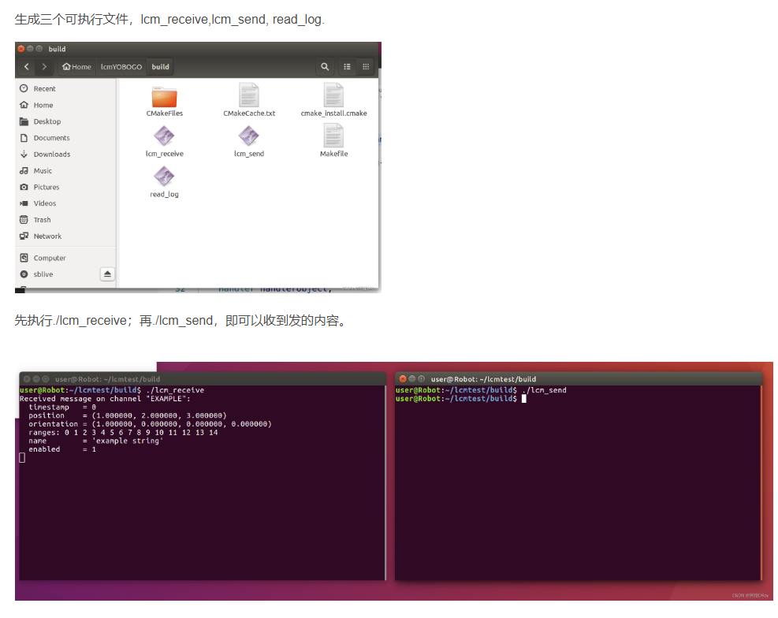

# NVIDIA Jetson AGX Orin 安装

## 1. 验证是否有Jetson 自带 CUDA Toolkit

```bash
# 1.1 识别 L4T 版本
head -n 1 /etc/nv_tegra_release       # R35 (release), REVISION: 5.0 …

# 1.2 核心驱动完整性（如缺失需重装 1.3）
lsmod | grep nvidia                   # 应至少看到 nvgpu nvidia

# 1.3 如上步为空，重新安装核心包
sudo apt install nvidia-l4t-kernel nvidia-l4t-kernel-headers \
                 nvidia-l4t-display-kernel nvidia-l4t-kernel-dtbs \
                 nvidia-l4t-jetson-io

# 1.4 GPU 与 CUDA 版本验证
nvcc --version                         # 显示 CUDA 版本

# 1.5 报错情况
# 如果出現 **bash: nvcc: command not found**，代表验证失败

# 运行
vim ~/.bashrc

# 在结尾添加
export LD_LIBRARY_PATH=/usr/local/cuda/lib export \
PATH=$PATH:/usr/local/cuda/bin

export PATH=$PATH:/usr/local/cuda/bin

# 随后运行

source ~/.bashrc
dpkg -l libcudnn8
dpkg -l | grep nvinfer
```

## 2. 安装所需工具，vscode；conda

### VScode

wget "[https://code.visualstudio.com/sha/download?build=stable&os=linux-deb-arm64](https://code.visualstudio.com/sha/download?build=stable&os=linux-deb-arm64)" -O vscode_arm64.deb

```bash
sudo apt install ./vscode_arm64.deb
```

### Conda

wget [https://repo.anaconda.com/miniconda/Miniconda3-latest-Linux-aarch64.sh](https://repo.anaconda.com/miniconda/Miniconda3-latest-Linux-aarch64.sh) -O ~/miniconda.sh

```bash
bash ~/miniconda.sh -b -p $HOME/miniconda3
~/miniconda3/bin/conda init --all
source ~/.bashrc
```

## 3. 创建环境并安装PyTorch

### 3.1 创建环境

```bash
# 3.1 创建隔离环境
conda create -n unitree-rl python=3.8 -y
conda activate unitree-rl

# 3.2 下载系统依赖（按 PyTorch release notes）
sudo apt install python3-pip libopenblas-base libopenmpi-dev \
                   libjpeg-dev zlib1g-dev
```

### 3.2 安装PyTorch

```bash
# 安装官方预编译 wheel并安装三件套
wget https://nvidia.box.com/shared/static/h34p5r5u1ft9yn7rqc1fw0rx7wrp69lm.whl \
     -O torch-2.0.0-cp38-cp38-linux_aarch64.whl
pip install torch-2.0.0-cp38-cp38-linux_aarch64.whl
pip install torchvision torchaudio --no-cache-dir
```

### 3.3 torchaudio 报错解决方案

```bash
# 0) 切到与 torch/torchvision 同级目录（unitree-rl 环境）
cd ..

# 1) 获取源码（任选其一，若某镜像不稳定可换用另一条）
git clone https://github.com/pytorch/audio.git torchaudio      # 官方
#git clone [https://gitee.com/mirrors_pytorch/audio](https://gitee.com/mirrors_pytorch/audio) torchaudio 备用

cd torchaudio
git checkout v2.1.0            # 对应 torch‑2.3.x

# 2) 保持 conda 环境干净
conda clean -all -y            

# 3) 固定 CMake 版本（官方最低要求 3.18；推荐 3.20）
conda install cmake=3.20 -y -c conda-forge

# 4) 编译并安装
USE_CUDA=1 pip install -v -e . --no-use-pep517
```

## 4. 编译 Unitree SDK

### 4.1 安装依赖环境

```bash
sudo apt install build-essential cmake pkg-config git \
                 libeigen3-dev libyaml-cpp-dev liblcm-dev \
                 libopenblas-dev libssl-dev
```

### 4.2 安装相关包并编译

```bash
conda activate unitree-rl

# 4.2.1 获取源码
git clone https://github.com/unitreerobotics/unitree_sdk2.git
cd unitree_sdk2 && mkdir build && cd build

# 4.2.2 生成 & 编译
cmake ..
make -j$(nproc)

# 4.3.3 Python 绑定
cd ../unitree_sdk2_python
pip install -e .
```

**OpenHomie 安装指南查看下方链接，安装环境后可以直接**
`pip install -r requirements.txt`[**https://github.com/OpenRobotLab/OpenHomie/tree/main/HomieDeploy**](https://github.com/OpenRobotLab/OpenHomie/tree/main/HomieDeploy)

## 5. 安装LCM套件（在Python环境）

参考链接：[https://blog.csdn.net/weixin_50084948/article/details/125395861](https://blog.csdn.net/weixin_50084948/article/details/125395861)

### 5.1 **安装LCM**

```bash
sudo apt install build-essential libglib2.0-dev cmake
sudo apt install liblcm-dev 

# 或者使用github安装 git clone https://github.com/lcm-proj/lcm.git

cd lcm
# 编译并安装
mkdir build && cd build
cmake ..
make -j4
sudo make install
```

### 2. 使用CMake组织工程并跑通通信示例

2.1 创建 lcm_test 文件夹，新建example_t.lcm文件

```bash

package exlcm;
struct example_t
{
    int64_t  timestamp;
    double   position[3];
    double   orientation[4]; 
    int32_t  num_ranges;
    int16_t  ranges[num_ranges];
    string   name;
    boolean  enabled;
}
```

打开 lcm_test 文件夹，运行

```bash
 lcm-gen -x example_t.lcm
```

命令生成消息类型，成功运行后会生成 exlcm 文件夹，文件夹中有example_t.hpp的头文件。若没有识别`lcm-gen`命令，则需要检查是否成功安装 lcm，或是否将 lcm 编译结果添加进环境变量。

2.2 创建`lcm_send.cpp`，`lcm_receive.cpp`，`read_log.cpp`，`example_t.lcm`，`CMakeLists.txt`五个文件，文件内容如下。
lcm_send.cpp：

```bash
#include <lcm/lcm-cpp.hpp>
 
#include "exlcm/example_t.hpp"
 
int main(int argc, char ** argv)
{
    lcm::LCM lcm("udpm://239.255.76.67:7667?ttl=1");
    if(!lcm.good())
        return 1;
    exlcm::example_t my_data;
    my_data.timestamp = 0;
    my_data.position[0] = 1;
    my_data.position[1] = 2;
    my_data.position[2] = 3;
    my_data.orientation[0] = 1;
    my_data.orientation[1] = 0;
    my_data.orientation[2] = 0;
    my_data.orientation[3] = 0;
    my_data.num_ranges = 15;
    my_data.ranges.resize(my_data.num_ranges);
    for(int i = 0; i < my_data.num_ranges; i++)
        my_data.ranges[i] = i;
    my_data.name = "example string from computer1";
    my_data.enabled = true;
    lcm.publish("EXAMPLE", &my_data);
    return 0;
}
```

lcm_receive.cpp

```bash
#include <stdio.h>
#include <lcm/lcm-cpp.hpp>
#include "exlcm/example_t.hpp"
class Handler 
{
    public:
        ~Handler() {}
        void handleMessage(const lcm::ReceiveBuffer* rbuf,
                const std::string& chan, 
                const exlcm::example_t* msg)
        {
            int i;
            printf("Received message on channel \"%s\":\n", chan.c_str());
            printf("  timestamp   = %lld\n", (long long)msg->timestamp);
            printf("  position    = (%f, %f, %f)\n",
                    msg->position[0], msg->position[1], msg->position[2]);
            printf("  orientation = (%f, %f, %f, %f)\n",
                    msg->orientation[0], msg->orientation[1], 
                    msg->orientation[2], msg->orientation[3]);
            printf("  ranges:");
            for(i = 0; i < msg->num_ranges; i++)
                printf(" %d", msg->ranges[i]);
            printf("\n");
            printf("  name        = '%s'\n", msg->name.c_str());
            printf("  enabled     = %d\n", msg->enabled);
        }
};
int main(int argc, char** argv)
{
    lcm::LCM lcm("udpm://239.255.76.67:7667?ttl=1");
    if(!lcm.good())
        return 1;
    Handler handlerObject;
    lcm.subscribe("EXAMPLE", &Handler::handleMessage, &handlerObject);
    while(0 == lcm.handle());
    return 0;
}
```

read_log.cpp：

```bash
#include <stdio.h>
 
#include <lcm/lcm-cpp.hpp>
 
#include "exlcm/example_t.hpp"
 
int main(int argc, char **argv)
{
    if (argc < 2) {
        fprintf(stderr, "usage: read_log <logfile>\n");
        return 1;
    }
 
    // Open the log file.
    lcm::LogFile log(argv[1], "r");
    if (!log.good()) {
        perror("LogFile");
        fprintf(stderr, "couldn't open log file %s\n", argv[1]);
        return 1;
    }
 
    while (1) {
        // Read a log event.
        const lcm::LogEvent *event = log.readNextEvent();
        if (!event)
            break;
 
        // Only process messages on the EXAMPLE channel.
        if (event->channel != "EXAMPLE")
            continue;
 
        // Try to decode the message.
        exlcm::example_t msg;
        if (msg.decode(event->data, 0, event->datalen) != event->datalen)
            continue;
 
        // Decode success!  Print out the message contents.
        printf("Message:\n");
        printf("  timestamp   = %lld\n", (long long) msg.timestamp);
        printf("  position    = (%f, %f, %f)\n", msg.position[0], msg.position[1], msg.position[2]);
        printf("  orientation = (%f, %f, %f, %f)\n", msg.orientation[0], msg.orientation[1],
               msg.orientation[2], msg.orientation[3]);
        printf("  ranges:");
        for (int i = 0; i < msg.num_ranges; i++)
            printf(" %d", msg.ranges[i]);
        printf("\n");
        printf("  name        = '%s'\n", msg.name.c_str());
        printf("  enabled     = %d\n", msg.enabled);
    }
 
    // Log file is closed automatically when the log variable goes out of
    // scope.
 
    printf("done\n");
    return 0;
}
```

CMakeLists.txt：

```bash
cmake_minimum_required(VERSION 3.1)
 
project(lcm_test)
 
find_package(lcm REQUIRED)
 
add_executable(lcm_receive lcm_receive.cpp)
 
add_executable(lcm_send lcm_send.cpp)
 
add_executable(read_log read_log.cpp)
 
target_link_libraries(lcm_receive lcm)
 
target_link_libraries(lcm_send lcm)
 
target_link_libraries(read_log lcm)
```

2.3 编译并运行，在lcm_test 文件夹下新建build文件夹，在build文件夹中执行

```bash
cmake ..
make
```

生成三个可执行文件，lcm_receive,lcm_send, read_log.

